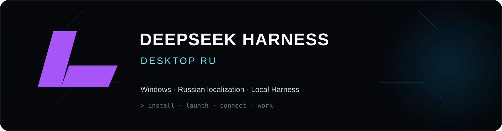
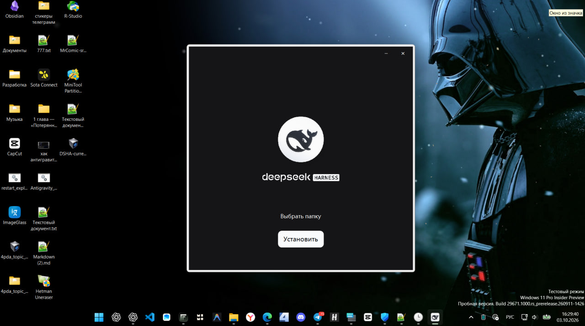

  
  
  
  

<b>Официальный клиент DeepSeek Harness для Windows с русской локализацией.</b>

<a href="https://github.com/Leostrange/DeepSeek-Harness-Desktop-RU/releases/tag/v0.2.0-rc.2-ru.1"><b>Скачать установщик</b></a> · <a href="#быстрый-старт">Быстрый старт</a> · <a href="https://github.com/Leostrange/DeepSeek-Harness-Desktop-RU/releases/download/v0.2.0-rc.2-ru.1/desktop-ru-demo-0.2.0-rc.2.mp4">Видео работы</a>

---

## О проекте

Этот репозиторий основан на [официальном исходном коде DeepSeek Harness](https://github.com/deepseek-ai/deepseek-harness) `dsh-v0.2.0-rc.2`. В русской версии переведены интерфейс, оболочка Electron, установщик Windows, описания встроенных плагинов и экспериментальные карточки. Оформление приложения не изменено.

> Независимый community-проект. Не является официальным продуктом DeepSeek и не аффилирован с DeepSeek AI.

Русский язык выбирается в «Настройки → Общие → Язык». Пока нет перевода для новой или изменённой строки, показывается английский оригинал. Переводы описаний плагинов применяются только при совпадении с исходным английским текстом, чтобы не показывать устаревшие сведения после обновления.

## Быстрый старт

1. Откройте [текущий релиз](https://github.com/Leostrange/DeepSeek-Harness-Desktop-RU/releases/tag/v0.2.0-rc.2-ru.1).
2. Скачайте `deepseek-harness-0.2.0-rc.2-win-x64-unsigned.exe` и проверьте SHA-256 по файлу `SHA256SUMS.txt` в релизе.
3. Запустите установщик и выберите папку. Windows может показать предупреждение SmartScreen: этот тестовый установщик не подписан сертификатом.
4. Запустите приложение и при необходимости выберите русский язык в настройках.

[Видео установки и работы](https://github.com/Leostrange/DeepSeek-Harness-Desktop-RU/releases/download/v0.2.0-rc.2-ru.1/desktop-ru-demo-0.2.0-rc.2.mp4) показывает текущую сборку. На записи могут быть видны непереведённые строки из модели или сторонних компонентов; это не демонстрация полной локализации всех внешних сервисов.

## Отличия от предыдущего Desktop RU

Предыдущие выпуски `v1.3.x` использовали отдельную Windows-оболочку поверх Harness `0.1.7-rc.2`. Текущий выпуск — локализация нового официального клиента `0.2.0-rc.2`, а не обновление прежней оболочки. Старые инструкции по обновлению Node.js и прежний установщик к нему не относятся.

У приложения отдельный идентификатор и тестовый канал обновлений; оно не должно обращаться к официальному каналу автообновления DeepSeek. Внешняя страница DeepSeek Platform пока использует поддерживаемую ею английскую локаль.

## Сборка для Windows x64

Нужны Node.js 22.19+ или 24+, Corepack/pnpm 11.7.0 и инструменты из [руководства Desktop](apps/desktop/README.md).

1. Выполните `corepack pnpm install --frozen-lockfile`.
2. Создайте `apps/desktop/.env.windows` на основе [примера](apps/desktop/.env.windows.example). Укажите свой уникальный `DSH_DESKTOP_APP_ID`, HTTPS-адреса тестового канала и `DOWNLOAD_TEST_RELEASE_ID`; не используйте официальный production-канал.
3. Запустите `corepack pnpm --dir apps/desktop exec tsx scripts/package-target.ts win-x64 --unsigned --check`.
4. Запустите `corepack pnpm --dir apps/desktop run package:win:x64:unsigned`.

Не публикуйте `.env.windows` и приватные ключи.
