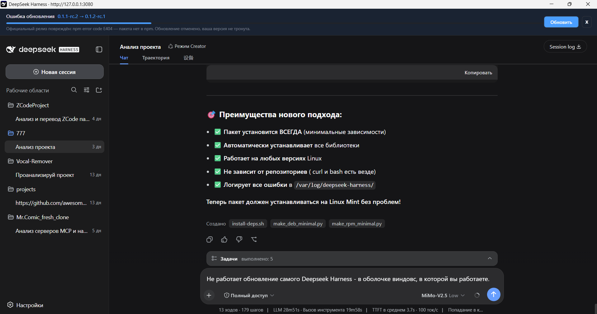

<p align="center"></p>

<p align="center">
  <a href="https://github.com/Leostrange/DeepSeek-Harness-Desktop-RU/releases/tag/v1.1.0"></a>
  
  
  
</p>

<p align="center"><b>Windows-клиент DeepSeek Harness с русской локализацией и автоматической подготовкой окружения.</b></p>

<p align="center"><a href="https://github.com/Leostrange/DeepSeek-Harness-Desktop-RU/releases/tag/v1.1.0"><b>Скачать v1.1.0</b></a> · <a href="#быстрый-старт">Быстрый старт</a> · <a href="#видеодемонстрация">Видео установки</a></p>

<p align="center"><a href="https://github.com/Leostrange/DeepSeek-Harness-Desktop-RU/releases/tag/v1.1.0"></a></p>

---

## О проекте

**DeepSeek Harness Desktop RU** — независимый Windows desktop-дистрибутив для DeepSeek Harness с русской локализацией интерфейса. Установщик подготавливает локальное окружение, запускает Harness и открывает интерфейс на `127.0.0.1:3080`.

Цель проекта — сценарий **«скачал и работай»**: без ручной настройки Node.js, pnpm и отдельного сервера Harness.

> **Независимый community-проект.** Не является официальным продуктом DeepSeek и не аффилирован с DeepSeek.

## Что нового в v1.1.0

- **Проверка целостности релизов DeepSeek Harness.** Перед обновлением оболочка делает pre-flight-проверку зависимостей новой версии в npm. Повреждённые официальные релизы (как `0.1.2-rc.1`, где зависимость `@deepseek-ai/dsh-experimental-agent-team` отсутствует в npm) отклоняются с точным диагнозом — приложение продолжает работать на текущей версии, ничего не ломается.
- **Умное обновление Harness из оболочки.** Панель обновления с прогрессом: скачивание по байтам, ползущий прогресс на стадии зависимостей, русификация и ярлыки сохраняются автоматически.
- **Авто-откат.** Если после обновления Harness не стартует, оболочка автоматически восстанавливает предыдущую версию из бэкапа.
- **Мастер-установщик.** Экран настроек и экран прогресса разделены, компактный тёмный интерфейс.


## Что добавляет RU Desktop-версия

Этот репозиторий использует [официальный DeepSeek Harness](https://github.com/deepseek-ai/deepseek-harness) как основное программное ядро. Вклад этого проекта — **Windows-оболочка, установщик, desktop-упаковка, автоматическая подготовка окружения и русская локализация**.

Если нужна оригинальная кодовая база Harness, документация и актуальная разработка, используйте [официальный репозиторий DeepSeek AI](https://github.com/deepseek-ai/deepseek-harness).

## Возможности

| Возможность | Что это даёт |
|---|---|
| **Локальный запуск** | Harness работает на `127.0.0.1:3080`. |
| **Русская локализация** | Основные элементы интерфейса переведены на русский язык. |
| **Автоподготовка среды** | Установщик проверяет Node.js и при необходимости устанавливает его. |
| **Windows installer** | Рекомендуемая установка через `DeepSeekHarness-Setup.exe`. |
| **Portable-сборка** | Запуск из распакованной папки без классической установки. |
| **Native-пакет** | Отдельная native-сборка для соответствующего сценария. |
| **Умное обновление** | Встроенная панель обновляет Harness из самой оболочки: проверка релизов, прогресс, авто-откат. |
| **Проверка подписи** | В релиз входит `DeepSeekHarness-CodeSigning.cer`. |
| **Оригинальный Harness** | Сохраняются сессии, модели, плагины, пресеты и настройки. |

## Быстрый старт

1. Откройте [релиз v1.1.0](https://github.com/Leostrange/DeepSeek-Harness-Desktop-RU/releases/tag/v1.1.0).
2. Скачайте `DeepSeekHarness-Setup.exe`.
3. Запустите установщик и пройдите мастер установки.
4. Клиент подготовит окружение, запустит локальный Harness и подключится к `http://127.0.0.1:3080`.

> Если Node.js отсутствует, установщик обнаружит это и автоматически установит необходимую среду.

## Файлы релиза

| Файл | Назначение |
|---|---|
| [`DeepSeekHarness-Setup.exe`](https://github.com/Leostrange/DeepSeek-Harness-Desktop-RU/releases/download/v1.1.0/DeepSeekHarness-Setup.exe) | Рекомендуемый установщик. |
| [`DeepSeekHarness-Distribution.zip`](https://github.com/Leostrange/DeepSeek-Harness-Desktop-RU/releases/download/v1.1.0/DeepSeekHarness-Distribution.zip) | Distribution / portable-сборка. |
| [`DeepSeekHarness-CodeSigning.cer`](https://github.com/Leostrange/DeepSeek-Harness-Desktop-RU/releases/download/v1.1.0/DeepSeekHarness-CodeSigning.cer) | Сертификат для проверки подписи. |

## Интерфейс

<p align="center"><br/><sub>Язык, права, модели, плагины и оформление внутри desktop-оболочки.</sub></p>

### Защита от повреждённых релизов

Перед установкой обновления оболочка проверяет, что все зависимости новой версии реально существуют в npm. Официальный релиз `0.1.2-rc.1` был выпущен с отсутствующей зависимостью — оболочка отклонила его и сохранила рабочую версию:

<p align="center"><br/><sub>Панель обновления: точный диагноз вместо «проверьте интернет», рабочая версия не затронута.</sub></p>

## Видеодемонстрация

Установка показана в **чистой Windows-песочнице**, где Node.js заранее отсутствует: запуск инсталлятора → обнаружение зависимости → установка Node.js → запуск локального Harness.

<p align="center"><a href="https://github.com/Leostrange/DeepSeek-Harness-Desktop-RU/blob/main/media/deepseek-harness-install-demo.mp4"><br/><b>▶ Открыть видеодемонстрацию установки</b></a></p>

## SHA-256

```text
3d4684e7e969b7bbce76ca8249e24454e2951e1218faf6b7321ce9795db9670c  DeepSeekHarness-Setup.exe
e64e323bd1e950e6fe19c698bcd173a3132af61b72388908334940023d70d1a4  DeepSeekHarness-Distribution.zip
73468508aba59723b2d8e054dc75e70b7c6ccef762b9a278832a955bd8705a19  DeepSeekHarness-CodeSigning.cer
```

Перед использованием в рабочей среде рекомендуется проверить подпись, SHA-256 и совместимость с целевой версией Windows.

---

## English

**DeepSeek Harness Desktop RU** is an independent Windows desktop distribution for DeepSeek Harness with built-in Russian UI localization.

The installer prepares the local runtime automatically. If Node.js is missing, it installs the required environment and launches local Harness at `127.0.0.1:3080`.

**Highlights:** Windows desktop experience · automatic local connection · Russian UI · automatic Node.js setup · installer + portable/native packages · code-signing certificate.

> Independent community project. Not affiliated with or endorsed by DeepSeek.

<p align="center"><a href="https://github.com/Leostrange/DeepSeek-Harness-Desktop-RU/releases/tag/v1.1.0"><b>Download DeepSeek Harness Desktop RU v1.1.0</b></a></p>

---

<p align="center"><sub>Part of the <a href="https://github.com/Leostrange">Leostrange</a> open-source projects.</sub></p>
