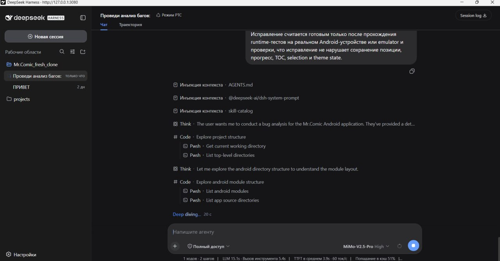
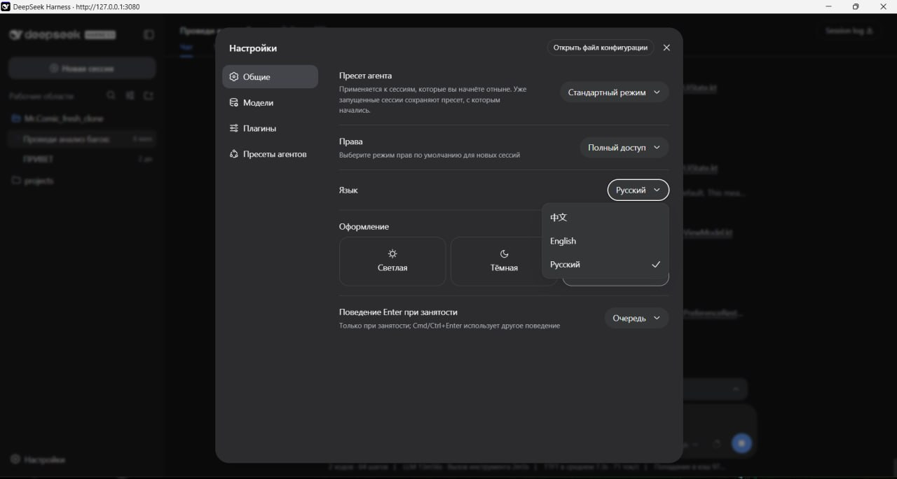

<div align="center">

# DeepSeek Harness Desktop RU

### Windows-клиент DeepSeek Harness с полноценной русской локализацией

<p>
  <a href="https://github.com/Leostrange/DeepSeek-Harness-Desktop-RU/releases/tag/v1.0.0"><strong>Release v1.0.0</strong></a>
  &nbsp;·&nbsp;
  <a href="https://github.com/Leostrange/DeepSeek-Harness-Desktop-RU/releases"><strong>Downloads</strong></a>
  &nbsp;·&nbsp;
  <strong>Windows 10/11</strong>
</p>

<p>
  <a href="https://github.com/Leostrange/DeepSeek-Harness-Desktop-RU/releases/tag/v1.0.0"><strong>Скачать релиз</strong></a>
  &nbsp;·&nbsp;
  <a href="#быстрый-старт">Быстрый старт</a>
  &nbsp;·&nbsp;
  <a href="#видеодемонстрация">Смотреть видео</a>
</p>

<br>

<a href="https://github.com/Leostrange/DeepSeek-Harness-Desktop-RU/releases/tag/v1.0.0"></a>

</div>

## О проекте

**DeepSeek Harness Desktop RU** — первый публичный Windows-релиз клиента для DeepSeek Harness с русской локализацией интерфейса. Приложение упаковывает локальный Harness в удобный desktop-сценарий: установщик сам подготавливает окружение, запускает локальный сервис и открывает интерфейс на `127.0.0.1:3080`.

Проект рассчитан на запуск «скачал и работай»: пользователю не требуется вручную настраивать Node.js, pnpm или отдельный сервер Harness.

> **Независимый community-проект.** Не является официальным продуктом DeepSeek и не аффилирован с DeepSeek.

## Возможности

| Возможность | Описание |
| --- | --- |
| **Локальный запуск** | Подключение к Harness на `127.0.0.1:3080` без внешнего сервера. |
| **Русская локализация** | Основные элементы интерфейса Harness переведены на русский язык. |
| **Автоматическая подготовка среды** | Установщик проверяет наличие Node.js и при необходимости устанавливает его автоматически. |
| **Windows installer** | Рекомендуемый способ установки через `DeepSeekHarness-Setup.exe`. |
| **Portable-сборка** | Запуск из распакованной папки без классической установки. |
| **Native-пакет** | Отдельная native-сборка для соответствующего сценария запуска. |
| **Проверка подписи** | В комплект входит сертификат `DeepSeekHarness-CodeSigning.cer`. |
| **Оригинальный Harness** | Сохраняются основные рабочие области, сессии, модели, плагины, пресеты и настройки. |

## Быстрый старт

1. Откройте страницу [релиза v1.0.0](https://github.com/Leostrange/DeepSeek-Harness-Desktop-RU/releases/tag/v1.0.0).
2. Скачайте `DeepSeekHarness-Setup.exe` из блока **Assets**.
3. Запустите установщик и следуйте шагам мастера.
4. После подготовки окружения клиент запустит локальный Harness и подключится к `http://127.0.0.1:3080`.

> **Важно:** если Node.js отсутствует в системе, установщик обнаружит это и автоматически установит необходимую среду. Именно этот сценарий показан в видеодемонстрации ниже на чистой Windows-песочнице.

## Файлы релиза

| Файл | Назначение |
| --- | --- |
| [`DeepSeekHarness-Setup.exe`](https://github.com/Leostrange/DeepSeek-Harness-Desktop-RU/releases/download/v1.0.0/DeepSeekHarness-Setup.exe) | Рекомендуемый установщик Windows-клиента. |
| [`DeepSeekHarness-Distribution.zip`](https://github.com/Leostrange/DeepSeek-Harness-Desktop-RU/releases/download/v1.0.0/DeepSeekHarness-Distribution.zip) | Готовая distribution/portable-сборка. |
| [`DeepSeekHarness-Native.zip`](https://github.com/Leostrange/DeepSeek-Harness-Desktop-RU/releases/download/v1.0.0/DeepSeekHarness-Native.zip) | Отдельная native-сборка. |
| [`DeepSeekHarness-CodeSigning.cer`](https://github.com/Leostrange/DeepSeek-Harness-Desktop-RU/releases/download/v1.0.0/DeepSeekHarness-CodeSigning.cer) | Сертификат для проверки подписи. |

## Интерфейс

В приложении сохраняется привычный рабочий процесс Harness, а основные настройки и язык доступны прямо внутри desktop-оболочки.

<div align="center">



<sub>Настройки приложения: язык, права, модели, плагины и оформление.</sub>

</div>

## Видеодемонстрация

Ниже — демонстрация установки в **чистой Windows-песочнице**, где Node.js заранее не установлен. Видео показывает полный сценарий: запуск инсталлятора, автоматическое обнаружение отсутствующей среды, установку Node.js и последующий запуск локального DeepSeek Harness.

<div align="center">

<a href="https://github.com/Leostrange/DeepSeek-Harness-Desktop-RU/blob/main/media/deepseek-harness-install-demo.mp4">
  
  <br>
  <strong>▶ Открыть и посмотреть видеодемонстрацию установки</strong>
</a>

</div>

## Проверка целостности

При необходимости сверяйте SHA-256 загруженных файлов:

```text
ee93e434437ad301f9cb23c0f4080b952b578c3e3172a0b2b77cfd53c3a6d17d  DeepSeekHarness-Setup.exe
e9f3b7c0b7cb9225601227ea8725e79b72851befe692248566e8ff9e88591b2e  DeepSeekHarness-Distribution.zip
f454bae87e09790f7a444d3e5066c284d660247e527485c5dfa3e2e19da0efa4  DeepSeekHarness-Native.zip
73468508aba59723b2d8e054dc75e70b7c6ccef762b9a278832a955bd8705a19  DeepSeekHarness-CodeSigning.cer
```

## Статус проекта

Это первый публичный релиз проекта. Перед использованием в рабочей среде рекомендуется проверить подпись, SHA-256-хэши и совместимость с целевой версией Windows.

<div align="center">

**[Скачать DeepSeek Harness Desktop RU v1.0.0](https://github.com/Leostrange/DeepSeek-Harness-Desktop-RU/releases/tag/v1.0.0)**

</div>

---

## English

**DeepSeek Harness Desktop RU** is an independent Windows desktop distribution for DeepSeek Harness with built-in Russian UI localization.

The installer prepares the local runtime automatically. If Node.js is not installed, it detects the missing dependency, installs the required Node.js environment, and then launches the local Harness at `127.0.0.1:3080`. The video demonstration shows this flow in a clean Windows sandbox.

### Highlights

- standalone Windows experience;
- automatic connection to local DeepSeek Harness;
- built-in Russian localization;
- automatic Node.js setup when it is missing;
- compact installer, distribution archive and native package;
- code-signing certificate included in the release.

> Independent community project. Not affiliated with or endorsed by DeepSeek.

<div align="center">

**[Download DeepSeek Harness Desktop RU v1.0.0](https://github.com/Leostrange/DeepSeek-Harness-Desktop-RU/releases/tag/v1.0.0)**

</div>
