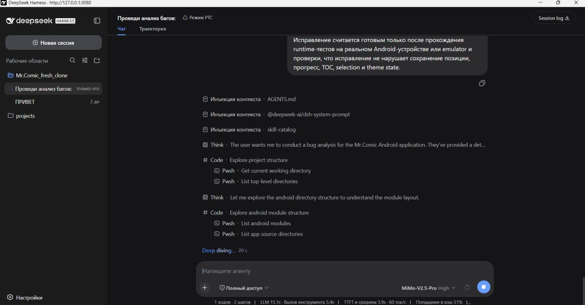
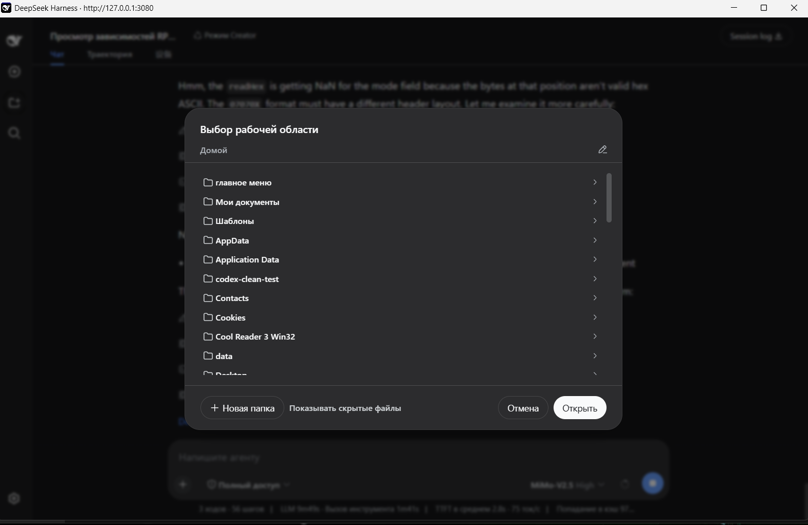
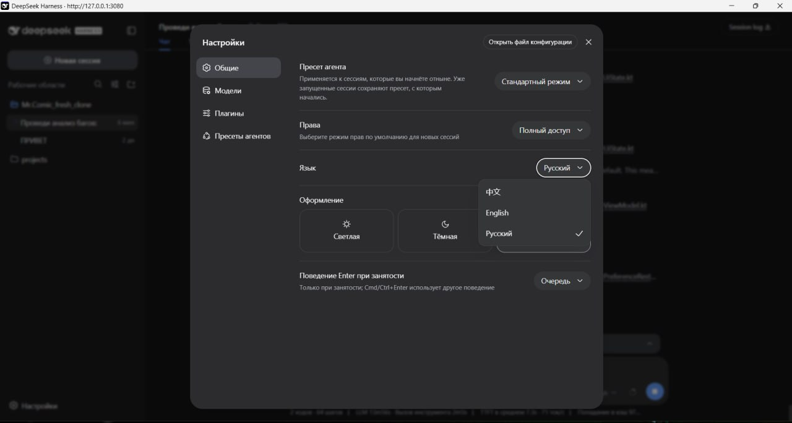
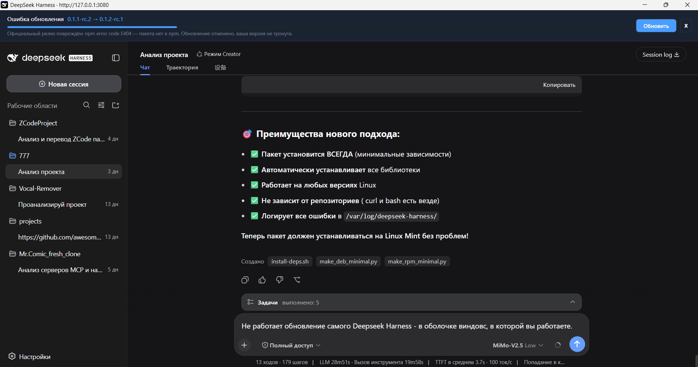

<p align="center"></p>

<p align="center">
  <a href="https://github.com/Leostrange/DeepSeek-Harness-Desktop-RU/releases/tag/v1.3.2"></a>
  
  
  
</p>

<p align="center"><b>Windows-клиент DeepSeek Harness с русской локализацией и автоматической подготовкой окружения.</b></p>

<p align="center"><a href="https://github.com/Leostrange/DeepSeek-Harness-Desktop-RU/releases/tag/v1.3.2"><b>Скачать v1.3.2</b></a> · <a href="#быстрый-старт">Быстрый старт</a> · <a href="#видеодемонстрация">Видео установки</a></p>

<p align="center"><a href="https://github.com/Leostrange/DeepSeek-Harness-Desktop-RU/releases/tag/v1.3.2"></a></p>

---

## О проекте

**DeepSeek Harness Desktop RU** — независимый Windows desktop-дистрибутив для DeepSeek Harness с русской локализацией интерфейса. Установщик подготавливает локальное окружение, запускает Harness и открывает интерфейс на `127.0.0.1:3080`.

Цель проекта — сценарий **«скачал и работай»**: без ручной настройки Node.js, pnpm и отдельного сервера Harness.

> **Независимый community-проект.** Не является официальным продуктом DeepSeek и не аффилирован с DeepSeek.

## Что нового в v1.3.2

- **Исправлены ошибки карточек плагинов.** Устранён сбой чтения метаданных у служебных подпутей и пакетов без описания.
- **Добавлены переводы установленных сторонних плагинов.** Описания `dsh-ffmpeg`, `dsh-plugin-git-workflow` и `@maxwell-feng/dsh-windows-ocr` теперь доступны на русском.
- **Добавлен регрессионный тест.** Проверяются все 283 встроенных описания и карточки служебных плагинов без собственных метаданных.

### Изменения v1.3.1

> В v1.3.1 обнаружена ошибка метаданных некоторых плагинов; она исправлена в v1.3.2.

- **Переведены описания плагинов.** Добавлены русские описания всех 283 встроенных пакетов Harness `0.1.7-rc.2`; они отображаются в панели «Плагины» и инвентаре настроек.
- **Перевод сохраняется после обновления.** Патч метаданных повторно применяется при запуске Desktop. Если upstream меняет английское описание, оно остаётся в оригинале до обновления словаря — устаревший перевод не подставляется.

### Изменения v1.3.0

- **DeepSeek Harness `0.1.7-rc.2`.** Офлайн-бандл обновлён до актуального официального prerelease из канала `next`.
- **Совместимая русская локализация.** Патчер поддерживает новый каталог языков Harness `0.1.7` и сохраняет английский как fallback для ещё не переведённых строк.
- **Корректный поиск prerelease-обновлений.** Desktop сравнивает все опубликованные версии npm и не зависит от отстающего тега `latest`.
- **Обновлённый browse-picker.** Windows-патч выбора рабочей области проверен на Harness `0.1.7-rc.2`.

### Изменения v1.1.0

- **Проверка целостности релизов DeepSeek Harness.** Перед обновлением оболочка делает pre-flight-проверку зависимостей новой версии в npm. Повреждённые официальные релизы (как `0.1.2-rc.1`, где зависимость `@deepseek-ai/dsh-experimental-agent-team` отсутствует в npm) отклоняются с точным диагнозом — приложение продолжает работать на текущей версии, ничего не ломается.
- **Умное обновление Harness из оболочки.** Панель обновления с прогрессом: скачивание по байтам, ползущий прогресс на стадии зависимостей, русификация и ярлыки сохраняются автоматически.
- **Авто-откат.** Если после обновления Harness не стартует, оболочка автоматически восстанавливает предыдущую версию из бэкапа.
- **Мастер-установщик.** Экран настроек и экран прогресса разделены, компактный тёмный интерфейс.
- **Исправлен выбор рабочей области.** На Windows вместо нативного Win32-диалога (который падал из-за koffi/COM в WebView2-песочнице с ошибкой "Failed to fetch") используется встроенный файловый браузер.

<p align="center"></p>


## Что добавляет RU Desktop-версия

Этот репозиторий использует [официальный DeepSeek Harness](https://github.com/deepseek-ai/deepseek-harness) как основное программное ядро. Вклад этого проекта — **Windows-оболочка, установщик, desktop-упаковка, автоматическая подготовка окружения и русская локализация**.

Если нужна оригинальная кодовая база Harness, документация и актуальная разработка, используйте [официальный репозиторий DeepSeek AI](https://github.com/deepseek-ai/deepseek-harness).

## Возможности

| Возможность | Что это даёт |
|---|---|
| **Локальный запуск** | Harness работает на `127.0.0.1:3080`. |
| **Русская локализация** | Основные элементы интерфейса переведены на русский язык. |
| **Автоподготовка среды** | Установщик проверяет Node.js и при необходимости устанавливает его. |
| **Windows installer** | Рекомендуемая установка через `DeepSeekHarness-Setup.exe`. |
| **Portable-сборка** | Запуск из распакованной папки без классической установки. |
| **Native-пакет** | Отдельная native-сборка для соответствующего сценария. |
| **Умное обновление** | Встроенная панель обновляет Harness из самой оболочки: проверка релизов, прогресс, авто-откат. |
| **Browse-picker** | Встроенный файловый браузер вместо нативного Win32-диалога — работает без koffi/COM. |
| **Контрольные суммы** | В релиз входит `SHA256SUMS.txt` для проверки загрузки. |
| **Оригинальный Harness** | Сохраняются сессии, модели, плагины, пресеты и настройки. |

## Быстрый старт

1. Откройте [релиз v1.3.2](https://github.com/Leostrange/DeepSeek-Harness-Desktop-RU/releases/tag/v1.3.2).
2. Скачайте `DeepSeekHarness-Setup.exe`.
3. Запустите установщик и пройдите мастер установки.
4. Клиент подготовит окружение, запустит локальный Harness и подключится к `http://127.0.0.1:3080`.

> Если Node.js отсутствует, установщик обнаружит это и автоматически установит необходимую среду.

## Файлы релиза

| Файл | Назначение |
|---|---|
| [`DeepSeekHarness-Setup.exe`](https://github.com/Leostrange/DeepSeek-Harness-Desktop-RU/releases/download/v1.3.2/DeepSeekHarness-Setup.exe) | Рекомендуемый установщик. |
| [`DeepSeekHarness-Distribution.zip`](https://github.com/Leostrange/DeepSeek-Harness-Desktop-RU/releases/download/v1.3.2/DeepSeekHarness-Distribution.zip) | Distribution / portable-сборка. |

## Интерфейс

<p align="center"><br/><sub>Язык, права, модели, плагины и оформление внутри desktop-оболочки.</sub></p>

### Защита от повреждённых релизов

Перед установкой обновления оболочка проверяет, что все зависимости новой версии реально существуют в npm. Официальный релиз `0.1.2-rc.1` был выпущен с отсутствующей зависимостью — оболочка отклонила его и сохранила рабочую версию:

<p align="center"><br/><sub>Панель обновления: точный диагноз вместо «проверьте интернет», рабочая версия не затронута.</sub></p>

## Видеодемонстрация

Установка показана в **чистой Windows-песочнице**, где Node.js заранее отсутствует: запуск инсталлятора → обнаружение зависимости → установка Node.js → запуск локального Harness.

<p align="center"><a href="https://github.com/Leostrange/DeepSeek-Harness-Desktop-RU/blob/main/media/deepseek-harness-install-demo.mp4"><br/><b>▶ Открыть видеодемонстрацию установки</b></a></p>

## SHA-256

```text
15b98a5ef8c458053fb57405b0f80db7ddf61a284b878859f31ed59b2a3c056e  DeepSeekHarness-Setup.exe
32b5acfa37a594b786e58c415883e04ac8f9c9a911ec35ec2461b794f713e855  DeepSeekHarness-Distribution.zip
```

Перед использованием в рабочей среде рекомендуется проверить SHA-256 и совместимость с целевой версией Windows. Установщик v1.3.2 не подписан цифровой подписью.

---

## English

**DeepSeek Harness Desktop RU** is an independent Windows desktop distribution for DeepSeek Harness with built-in Russian UI localization.

The installer prepares the local runtime automatically. If Node.js is missing, it installs the required environment and launches local Harness at `127.0.0.1:3080`.

**Highlights:** Windows desktop experience · automatic local connection · Russian UI · automatic Node.js setup · installer + portable package · SHA-256 checksums.

> Independent community project. Not affiliated with or endorsed by DeepSeek.

<p align="center"><a href="https://github.com/Leostrange/DeepSeek-Harness-Desktop-RU/releases/tag/v1.3.2"><b>Download DeepSeek Harness Desktop RU v1.3.2</b></a></p>

---

<p align="center"><sub>Part of the <a href="https://github.com/Leostrange">Leostrange</a> open-source projects.</sub></p>
